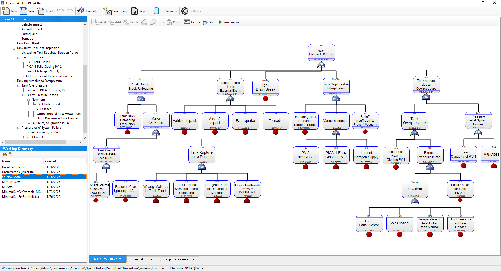

# Main Window Overview

The main window of the application is divided into several functional panels designed to support the complete workflow of Fault Tree Analysis (FTA).  
Below is an overview of each section.

## Screenshot

 
 

## Toolbar

The top toolbar provides quick access to the most commonly used actions:

- **New** – Create a new FTA project.
- **Open / Load** – Open an existing `.fta` file.
- **Save** – Save the current project.
- **Save Image** – Export the tree diagram as an image.
- **Report** – Generate an analysis report.
- **Evaluate / Run Analysis** – Perform the FTA calculations.
- **DB Browser** – Open the internal SQLite database viewer.
- **Settings** – Adjust application preferences.

Additional editing tools are located above the tree canvas:

- **Add / Delete / Copy / Paste**
- **Center** – Center the view on the selected node.
- **Sort** – Automatically reorder child nodes.
- **Run Analysis** – Start the analysis process.

---

## Tree Structure Panel

Located on the left side (top), this panel displays the hierarchical structure of the entire fault tree.

- Nodes can be expanded or collapsed.
- Selecting a node highlights it in the main canvas.
- A right-click menu provides quick access to actions like **Edit**, **Add child**, **Delete**, **Copy**, and **Go to Canvas**.
- Useful for fast navigation in large or complex trees.

---

## Working Directory Panel

Located on the left (bottom), this section lists all `.fta` files in the current working directory.

Columns:

- **Name** – File name.
- **Created** – Creation or last modification date.

Interactions:

- Click a file to load it.
- Right-click to open, delete, or open the folder in Explorer.
- The current working directory is shown in the status bar.

---

## Main Canvas

The main central area where the fault tree is visualized and edited.

Elements displayed:

- **Event boxes** – Contain the event ID, name, and probability/parameters.
- **Basic event markers** – Small red diamonds for leaf events.
- **Gate symbols** – AND, OR, and other logical gate types.
- **Connections** – Lines linking events and gates.

Interactions:

- **Click** to select a node.
- **Double-click** to edit node properties.
- **Drag / Pan / Zoom** using mouse and wheel.
- **Right-click** for contextual actions (Edit, Add child, Delete, Properties).
- Supports drag-and-drop loading from the Working Directory.

---

## Bottom Tabs

Three main analytical views:

### Main Tree Structure
The default graphical view of the fault tree.

### Minimal Cut Sets
Displays minimal combinations of basic events leading to the top event.  
Available after running the analysis.

### Importance Measure
Shows importance metrics of basic events (e.g., Birnbaum, Fussell-Vesely).

---

## Status Bar

Located at the bottom of the window. It shows:

- Current working directory.
- The name of the active `.fta` project.
- Short messages about recent actions or analysis progress.

---

## Quick Tips

- Use the **Tree Structure** panel for fast navigation.
- Use **Center** to focus the canvas on the selected node.
- Use **Sort** to automatically improve diagram readability.
- After editing the tree, run **Evaluate** to update cut sets and importance measures.
- Use **Save Image** to export diagrams for documentation.

